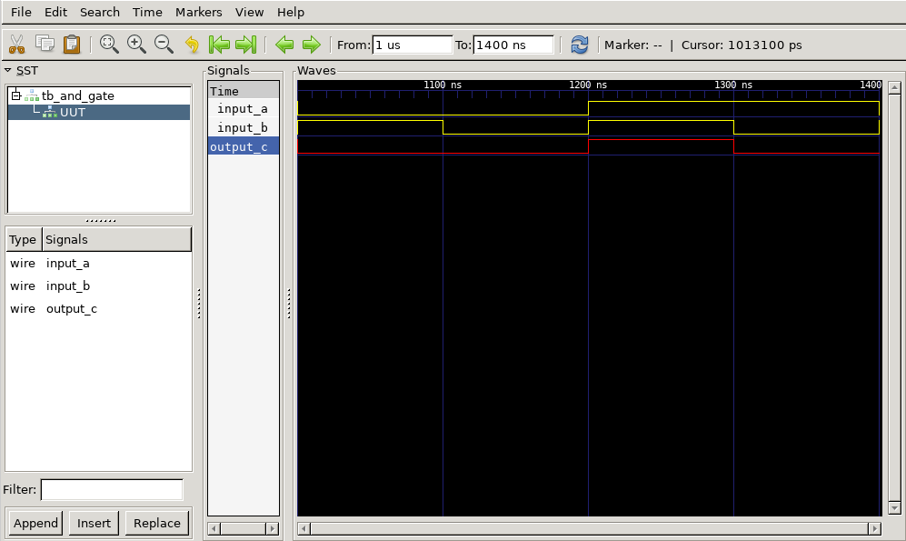

# AND Gate

- Vivado : 2023.2
- GTKWave: 3.3.104

This very simple project is used to introduce the VHDL syntax for entity, architecture and test bench definition, as well as TCL scripts and storing waveforms for latter visualization using GTKWave. 

Typically test-benches end in a `wait` (endless) statement so one can explore the waveforms in the GUI. However I saw problems when storing the waveform as `vcd` file. With this endless wait, the vcd file is empty, containing only the definitions of the signals.

To run the simulation do:

`vivado -mode batch -source run_simulation.tcl`

Then, to open the waveform with GTKWave:

`gtkwave ./vivado_project/and_gate_simulation.sim/sim_1/behav/xsim/and_gate_waveform.vcd`

To open the project with Vivado GUI:

`vivado vivado_project/and_gate_simulation.xpr`
