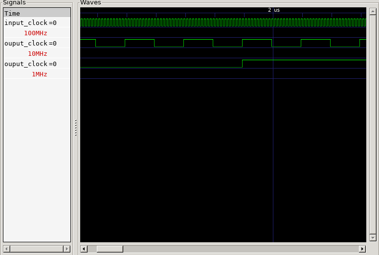

# Simple Clock Divider

- Vivado : 2023.2
- GTKWave: 3.3.104

Given a input clock of a given frequency, we want to generate another clock with smaller frequency by reducing it by a factor of N.
If we have a clock of 150 MHz, we can count 150 million periods and generate a 1 second clock, for instance.

We use `generic` ports as well as `time` type `constants`

To run the simulation do:

`vivado -mode batch -source run_clock_divider.tcl`

Then, to open the waveform with GTKWave:

`gtkwave ./vivado_clock/clock_divider.sim/sim_1/behav/xsim/clock_divider.vcd`

The test bench instansiates the `simple_clock_divider` module two times. In each time we reduce the clock by a factor of 10. Starting from 100MHz, we end up with a 1MHz clock.

