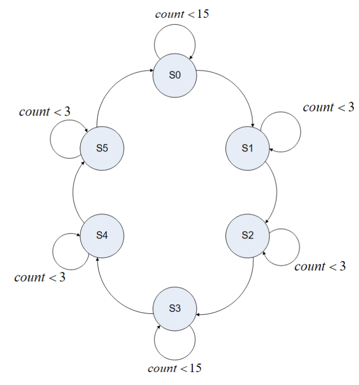
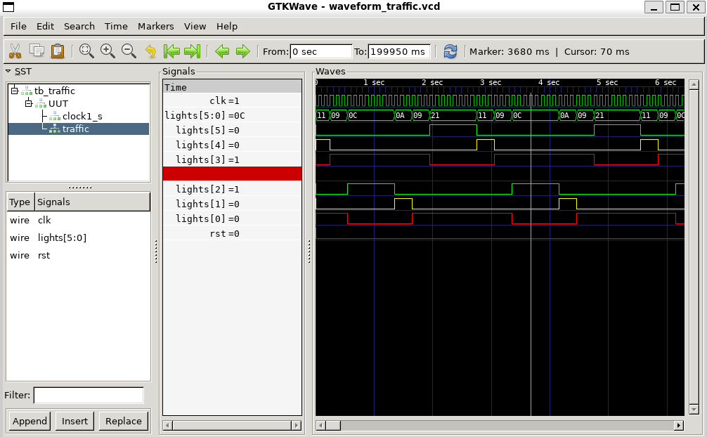

# Traffic Lights

Consider a four-way intersection with one street going nort-sout and the other road going east-west. The intersection is then controlled by two traffic lights. We want to simlaute these traffic lights in 6 different states:

| State | North - South | East - West | Delay (sec)|
|-------|---------------|-------------|------------|
| 0     | Green         | Red         |    15      |
| 1     | Yellow        | Red         |     3      |
| 2     | Red           | Red         |     3      |
| 3     | Red           | Green       |    15      |
| 4     | Red           | Yellow      |     3      |
| 5     | Red           | Red         |     3      |

Finally, the diagram for the state machine is this one:

Waveform from GTKWave of the top-level TestBench
